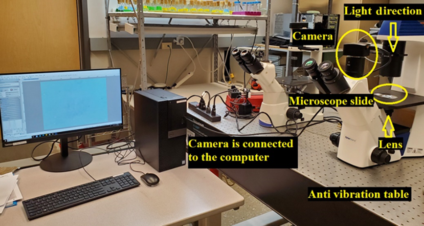
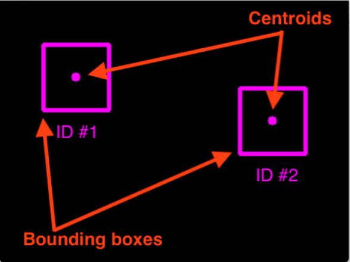
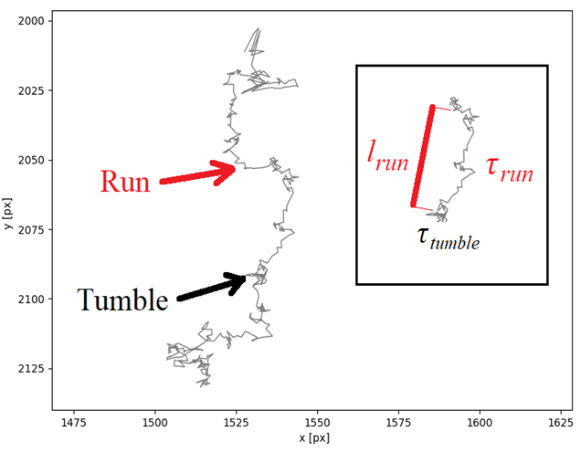

This is a repository of My Master's thesis about the particle bounding box detection with YoloV5 and their tracking, trajectories, using centroid tracker.

The experimental setup is shown below:

The sample of image which was used for training for YoloV5 (obtained from ultralytics) is also shown below:

One of the big challenges here was labeling of bboxes in thousands of these image manually and use these images for training the YoloV5. After the training the model was run on the rest of these images to extract the bbox locations from images.
The original image size was 2584 * 1936, which was resized (with padding to keep aspect ration the same) to the size of 640 * 640 for training yoloV5.

The centroid tracker was a simple algorithm for providing ID to the detected bboxes in sequences of frames of video. The algorithm was obtained from PyImageSearch.
The algorithm just provides id based on the maximum allowable distance center-2-center from one frame to another and maximum allowable to be disappeared from one frame, similar to the following image:

After the tracking, I am able to investigate the type of behavior and trajectory of particles in videos. A result of one video is shown below:

---------------------------------------------------------------------------------------------------------------
The architecture of the yoloV5 with one class is as follows:
# Parameters
nc: 1 # number of classes
depth_multiple: 0.67 # model depth multiple
width_multiple: 0.75 # layer channel multiple
anchors:
  - [10, 13, 16, 30, 33, 23] # P3/8
  - [30, 61, 62, 45, 59, 119] # P4/16
  - [116, 90, 156, 198, 373, 326] # P5/32

# YOLOv5 v6.0 backbone
backbone:
  # [from, number, module, args]
  [
    [-1, 1, Conv, [64, 6, 2, 2]], # 0-P1/2
    [-1, 1, Conv, [128, 3, 2]], # 1-P2/4
    [-1, 3, C3, [128]],
    [-1, 1, Conv, [256, 3, 2]], # 3-P3/8
    [-1, 6, C3, [256]],
    [-1, 1, Conv, [512, 3, 2]], # 5-P4/16
    [-1, 9, C3, [512]],
    [-1, 1, Conv, [1024, 3, 2]], # 7-P5/32
    [-1, 3, C3, [1024]],
    [-1, 1, SPPF, [1024, 5]], # 9
  ]

# YOLOv5 v6.0 head
head: [
    [-1, 1, Conv, [512, 1, 1]],
    [-1, 1, nn.Upsample, [None, 2, "nearest"]],
    [[-1, 6], 1, Concat, [1]], # cat backbone P4
    [-1, 3, C3, [512, False]], # 13

    [-1, 1, Conv, [256, 1, 1]],
    [-1, 1, nn.Upsample, [None, 2, "nearest"]],
    [[-1, 4], 1, Concat, [1]], # cat backbone P3
    [-1, 3, C3, [256, False]], # 17 (P3/8-small)

    [-1, 1, Conv, [256, 3, 2]],
    [[-1, 14], 1, Concat, [1]], # cat head P4
    [-1, 3, C3, [512, False]], # 20 (P4/16-medium)

    [-1, 1, Conv, [512, 3, 2]],
    [[-1, 10], 1, Concat, [1]], # cat head P5
    [-1, 3, C3, [1024, False]], # 23 (P5/32-large)

    [[17, 20, 23], 1, Detect, [nc, anchors]], # Detect(P3, P4, P5)
  ]

After detecting the particles from images they were tracked by their ID in video for investigating their type of trajectories and behaviors. A sample of trajectory is shown below:

